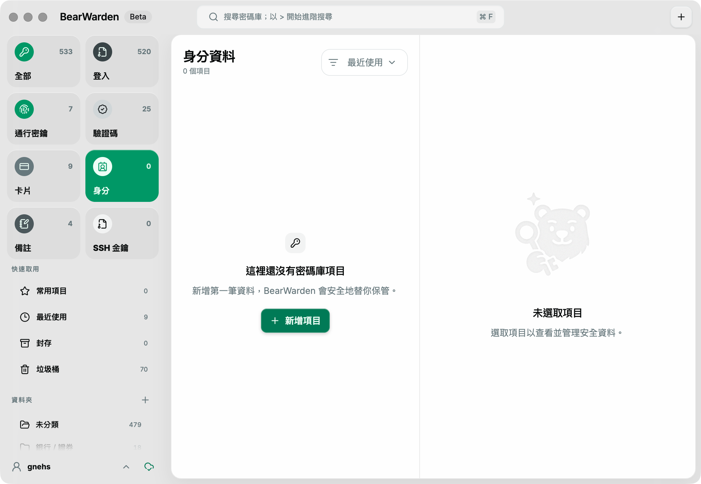

# BearWarden

**English** | [繁體中文](README.zh.md)

> [!CAUTION]
>
> ## Important warnings and disclaimer
>
> BearWarden is currently experimental software and contains a substantial amount of code generated or modified through vibe coding. **Before use, fully back up your vault through another trusted method and confirm that the backup can be restored successfully. Do not use BearWarden as the sole copy of any important passwords or data.**
>
> This software has not undergone an independent cryptographic review, security audit, or security certification. It may contain defects that cause passwords, attachments, keys, or an entire vault to be accidentally lost, corrupted, deleted, exposed, or stolen. By downloading, installing, or using this software, you acknowledge and assume these risks.
>
> To the maximum extent permitted by applicable law, the developers and contributors are not liable for any data loss, account compromise, financial loss, or other direct or indirect damages arising from use of, or inability to use, this software.

BearWarden is a desktop password manager focused on finding things quickly and using them confidently. Its interface uses a three-pane workflow and supports search, favorites, recent-use ordering, and drag-and-drop organization of login items into folders.



> The screenshot is of an in-development Beta; the interface and functionality may continue to change.

## Installation

### macOS (Homebrew)

```bash
brew install --cask gnehs/tap/bearwarden
```

## Implemented scope

- Create, unlock, and lock local vaults with a master password.
- Create, view, edit, and delete login items.
- Store multiple ordered URIs for each login item and configure Bitwarden-compatible URI match rules.
- Configure account-level custom and built-in equivalent domains; the passkey creation selector filters login items by the current origin, URI match, and equivalent domains.
- Keep up to five isolated local accounts; reorder them by stable local code, lock the current vault and fully restart before switching accounts, and safely remove local data for non-current accounts after explicit confirmation.
- Keep the latest five password/hidden-field history entries; details show only a safe count and read plaintext only after a confirmation warning and required master-password reprompt.
- Trash, restore items, permanently delete, and empty trash, including bulk moving, restoring, and permanently deleting selected items.
- Copy, archive, unarchive, and filter items by archive status, including bulk moving, archiving, and unarchiving.
- Create, rename, reorder, and delete folders.
- Drag login items into folders and use a keyboard-operable move menu.
- Global search, favorites, frequency-of-use, recent-use, and recently-modified sorting.
- Experimental macOS `Ctrl+\\` cross-browser autofill: with user-authorized Accessibility access, reads the current URL in Safari, Chrome, Edge, Arc, Brave, Vivaldi, Opera, or Firefox; fills a single match directly or presents a keyboard-operable quick selector for multiple matches. Before filling, it revalidates the browser signature, URL, field location, and password-field semantics. Chromium community builds without a fixed official signature are outside the supported scope.
- Passwords are masked by default, with explicit reveal, copy, and open-website actions.
- Generate Bitwarden-compatible one-time passwords, supporting Base32, `otpauth://` custom algorithms/digits/periods, and Steam Guard; invalid or future formats can still synchronize unchanged.
- When creating an SSH Key item, securely generate an Ed25519 key in the main process, or import password-protected Ed25519, RSA, and ECDSA private keys in OpenSSH/PKCS#8 format from the clipboard, normalizing them into matching OpenSSH private keys, public keys, and `SHA256:` fingerprints.
- Built-in SSH Agent can enumerate and sign with Ed25519, RSA SHA-2, and ECDSA P-256/P-384/P-521 keys; supports ask every time, automatic approval, or remember until lock, plus verified forwarding-host scope.
- Securely generate passwords, EFF long-word passphrases, random usernames, Plus Addresses, and catch-all email addresses locally; the latest 200 results are retained in encrypted history.
- Import Bitwarden JSON and export independently password-protected JSON, Bitwarden-compatible plaintext attachment ZIPs, or a BearWarden encrypted full backup.
- Support master-password reprompts; short-lived authorization exists only in the main process and is bound to the window, item set, and vault generation.
- Electron renderer sandboxing, context isolation, named IPC, and external-URL validation.
- Automatically lock the vault when the system locks or sleeps.
- Two-way sync directly with Bitwarden Cloud or Vaultwarden, without relying on the `bw` CLI.
- Synchronize personal-vault items, folders, multiple URIs/matches, password history, reprompts, archive state, and trash state; conflict copies prevent overwrites.
- Receive Bitwarden/Vaultwarden real-time notifications through SignalR MessagePack; remote changes merge through an authoritative full sync, including after reconnection.
- End-to-end encrypted synchronization of personal text Sends; create/edit/remove password/delete actions; file-Send metadata synchronization and main-process Direct multipart creation/upload; and main-process copying of share links.
- Synchronize decrypted attachment filenames, sizes, and legacy status, and safely upload, download, delete, and repair legacy attachments. Operations provide progress and proactive cancellation; keys, short-lived URLs, file paths, and content exist only in the main process.

## Data security model

- The master password is not written to disk.
- The vault is encrypted with password-KDF-derived keys and authenticated encryption before writing to app data.
- Each write first creates a temporary file with `0600` permissions, then atomically replaces the vault.
- Removing a local account first writes a journal with no personal data, commits the registry, and checkpoints primary/backup; only then does it isolate the account directory as a tombstone and delete it. If interrupted, it safely resumes on the next launch and does not affect the server account.
- The renderer has no Node.js, arbitrary IPC, or filesystem capabilities; login lists do not include passwords.
- Import/export paths and file content are handled only by the main process; backups are written using a `0600` temporary file, fsync, and atomic replacement.
- SSH private-key import reads the clipboard only once in the main process; the renderer receives only a short-lived, single-use token bound to the window and vault generation, the public key, and fingerprint. Locking, cancellation, expiry, or application exit clears incomplete sessions.
- SSH Agent private keys, public-key blobs, and content to be signed stay only in the main process; the renderer receives only an item name, fingerprint, purpose, and forwarding state. Each approval uses a short-lived, single-use grant that becomes invalid on lock, disablement, renderer reload, or timeout.
- Attachment uploads create a separate key and authenticated type-2 encryption envelope in the main process, then send it through the server-specified Direct or Azure flow. Downloads reacquire short-lived URLs, validate metadata first, then validate HMAC/decrypt in the main process and write using a `0600` temporary file and atomic replacement. Upload, download, delete, and legacy Fix provide progress, proactive cancellation, and lock abort; plaintext Buffers are cleared after use.
- Attachments are encrypted/decrypted as 1 MiB chunks in the main process, with the same 500 MiB plaintext limit as Bitwarden desktop. Encryption envelopes are written only to short-lived temporary files with `0600` permissions and are cleared after validation, cancellation, or failure.
- BearWarden `.bwbackup` encrypts personal items and attachments with an independent backup password, validates incrementally, supports interrupted resumption and atomic completion, and performs a complete preflight before restore. It is BearWarden's full-backup format, not a Bitwarden-compatible ZIP.
- Bitwarden attachment ZIPs stream the official personal-vault `data.json` and attachment directory format. Their output is entirely unencrypted; store it only on a trusted encrypted disk and securely delete it after use.
- Lists of reprompt-protected items do not include usernames, URIs, or TOTP metadata; the capability obtained after master-password verification expires after 60 seconds.
- Locking clears keys and decrypted data from the main process.

Bitwarden's Password Manager SDK is not currently a public, stable API, so this project does not misuse `@bitwarden/sdk-napi` (the Secrets Manager SDK) as a personal-vault data layer.

### Windows Remote Desktop and screen-capture protection

**Settings → Security → Prevent screen capture** is off by default. When enabled, Windows excludes BearWarden windows from screen capture; the window may be completely invisible during Remote Desktop, screen sharing, or recording, leaving only a taskbar icon. If that happens, return to the local Windows session, turn this option off, and reconnect. Development mode always disables this protection so `pnpm dev` can be debugged through Remote Desktop.

## SSH Agent

After enabling **Settings → SSH Agent**, BearWarden lets OpenSSH and Git use SSH Keys in the vault according to the [Bitwarden SSH Agent usage model](https://bitwarden.com/help/ssh-agent/). The Agent can respond while the vault is locked; before its first unlock it asks to open BearWarden, and afterwards it can enumerate cached public identities, but every actual signature still requires unlocking.

The default socket on macOS/Linux is `~/.bearwarden-ssh-agent.sock`. In the shell where it will be used, run the command shown in Settings:

```bash
export SSH_AUTH_SOCK="$HOME/.bearwarden-ssh-agent.sock"
```

To change where BearWarden creates its socket, set `BEARWARDEN_SSH_AUTH_SOCK` before starting BearWarden, then assign the same path to `SSH_AUTH_SOCK`. A custom socket must be in a trusted, writable location. BearWarden removes only sockets it has confirmed are stale, rejects symlinks and regular files, and sets new socket permissions to `0600`.

Windows uses OpenSSH's fixed `\\.\pipe\openssh-ssh-agent` named pipe. Before enabling it, disable the system OpenSSH Authentication Agent to prevent another agent from occupying the pipe.

**Remember until lock** remembers local requests and forwarding hosts verified via `session-bind@openssh.com` separately. Forwarding requests without a verified host fingerprint are not remembered. When an item has master-password reprompt enabled, the master password must be entered again regardless of the Agent approval strategy selected.

## Import, interoperable export, and encrypted backup

In **Settings → Data portability**, you can import unencrypted or password-protected Bitwarden JSON and create password-protected portable JSON, Bitwarden-compatible plaintext ZIPs with attachments, or resumable-restoration BearWarden encrypted `.bwbackup` files. Every export revalidates the current master password in the main process first; the backup password does not become the BearWarden master password, and plaintext ZIP explicitly does not accept a backup password.

Imports follow Bitwarden's non-deduplication semantics: each folder and item receives a new local ID, and colliding folder names receive an `Imported` suffix; JSON import skips trashed items. JSON export excludes trash, attachments, and Sends; attachment ZIPs also exclude trash and Sends under the official rules. The official product currently provides only attachment-ZIP export and has no ZIP-import format that can losslessly restore attachments in bulk, so BearWarden does not guess attachment ownership from potentially ambiguous item names; use `.bwbackup` for complete restore. Account-restricted encrypted JSON is bound to its original account key and cannot be carried across accounts, so only the [official password-protected encrypted export](https://bitwarden.com/help/encrypted-export/) is currently supported. Its PBKDF2 and Argon2id KDFs can both be imported; format and limitations follow [Bitwarden Import Data](https://bitwarden.com/help/import-data/).

## Bitwarden/Vaultwarden synchronization

BearWarden directly implements the login, KDF, end-to-end encryption, and synchronization flows used by the Bitwarden desktop client, so it does not require installing `bw`. This is a compatibility protocol rather than a stable public API; upgrades must be compatibility-tested against Bitwarden Cloud and supported Vaultwarden versions.

After opening **Bitwarden Sync** in BearWarden's left sidebar:

- Use `https://bitwarden.com` as the server URL for Bitwarden Cloud.
- For Vaultwarden, enter the HTTPS root URL of the deployment; only the backend permits loopback HTTP for development testing.
- Password login supports PBKDF2 and Argon2id accounts, new-device email verification with resend, and Authenticator, Email, YubiKey OTP, or WebAuthn security-key two-step verification. A server-issued remembered two-step token is stored only with the encrypted direct-sync session and is cleared if the server rejects it. WebAuthn here is a second factor, not Bitwarden's WebAuthn/PRF passwordless login. Duo and Organization Duo login challenges are not supported.
- SSO, Key Connector, Trusted Device Encryption, API-key login, and using Login with Device to sign BearWarden itself in are not supported. An already signed-in and unlocked BearWarden can act as the Login with Device initiator: it can verify the fingerprint and approve or reject another device's pending request.
- You can list, add, and remove account FIDO2 two-step-login keys one by one; challenges, assertions, attestations, and server verification tokens for login and registration are handled only in a restricted main-process window and never enter the primary renderer.
- The connected state displays email-verification and two-factor status; before verification, you can ask the server to resend the verification email.
- After revalidating the master password in the main process, you can copy the personal API Client ID/Secret or rotate it after a second confirmation. The Secret is not returned to the renderer or written to the vault, and the clipboard is cleared no later than 30 seconds.

The master password is not written to the BearWarden vault or settings; it is used only in main-process memory during login or unlock, and derived keys are cleared on lock. Login tokens, sync settings, and ID mappings are stored only in the encrypted local vault.

Current sync scope includes personal-vault items, folders, archives, trash, attachments, text Sends, file-Send metadata and Direct multipart create/upload/download, account equivalent domains, and read-only mirrors of Organizations, provider Organizations, Collections, and shared ciphers. It also consumes `PoliciesNew` with legacy fallback and enforces the applicable Password Generator, Remove Unlock with PIN, Disable Send, Disable Personal Vault Export, Organization Data Ownership, Restricted Item Types, and Maximum Vault Timeout restrictions at the affected operation boundary. File-Send editing after creation, Azure file-Send transport, independent public-receive pages, and advanced recipient verification are not supported. Emergency Access can currently read trusted/granted status, but does not perform invitations, takeover, or key rotation. Attachment metadata follows the server and supports safe upload, download, deletion, and legacy Fix; equivalent domains allow editing custom groups and excluding server-built-in groups in Settings. The organization page filters shared items by organization and Collection; password visibility is determined by server permissions, and shared items do not enter the personal merge or write flow. The main process connects to the official SignalR MessagePack notification hub, ignores events from this device, and requests an authoritative full sync on remote changes, initial connection, and reconnection; it does not yet apply the official client's per-event incremental cipher/folder/Send updates. A disabled or temporarily unavailable notification service does not prevent manual sync. Passkeys can synchronize, display, and be deleted safely, and BearWarden has a provider-neutral create/get approval flow, but no signed browser or operating-system provider transport currently exposes that flow to external websites. Synchronized custom fields can be safely displayed and edited in item details. Unsupported cipher types and incompatible account modes fail closed with a reason-specific, sanitized diagnostic report instead of being silently skipped or exposing server data. The main attachment flow is covered by automated fixtures, but live-server compatibility validation remains future work. The full support matrix and implementation boundaries are recorded in [`docs/vaultwarden-feature-gap.md`](docs/vaultwarden-feature-gap.md). When updating an existing login, the direct connector preserves remote fields that BearWarden does not support. If both sides change simultaneously, the remote version remains the primary item and local changes create a separate `(BearWarden conflict)` copy.

V1 AES-CBC-HMAC and Account Encryption V2 personal vaults are currently supported. V2 strictly validates COSE/XChaCha20-Poly1305, Ed25519 or ML-DSA-44 security state, signed public keys, and wrapped account private keys; the `Cipher.data` SealedCipherBlob for newer personal items also supports the legacy XChaCha envelope and the current AES-256-GCM data envelope. Validation failures do not expose data or perform remote writes. Key Connector and SSO/Trusted Device Encryption remain sync-locked and do not fall back to legacy keys.

## Development

Requirements: Node.js 24.13.1 or later and pnpm 11.12.0.

```bash
pnpm install --frozen-lockfile
pnpm dev
```

Electron 43 and later downloads the platform binary on first use. `pnpm dev` and `pnpm start` first run the official `install-electron` to prevent electron-vite from incorrectly reporting `Electron uninstall` before the binary is ready.

### Localization

Renderer messages use English source text with Lingui catalogs for English, Simplified Chinese,
Traditional Chinese, and Japanese. After changing user-facing copy, update and validate the
catalogs with:

```bash
pnpm i18n:extract
pnpm i18n:compile
```

## Verification

```bash
pnpm lint
pnpm typecheck
pnpm test
pnpm build
pnpm build:unpack
pnpm audit --prod
```

## Packaging

```bash
pnpm build:mac
pnpm build:win
pnpm build:linux
```

Before a production release, signing, notarization, installation, and upgrade-path testing must still be completed on the corresponding operating system.
